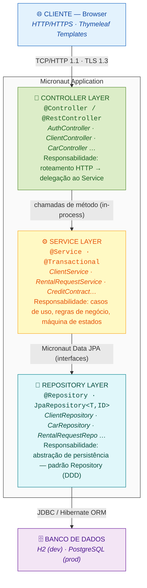
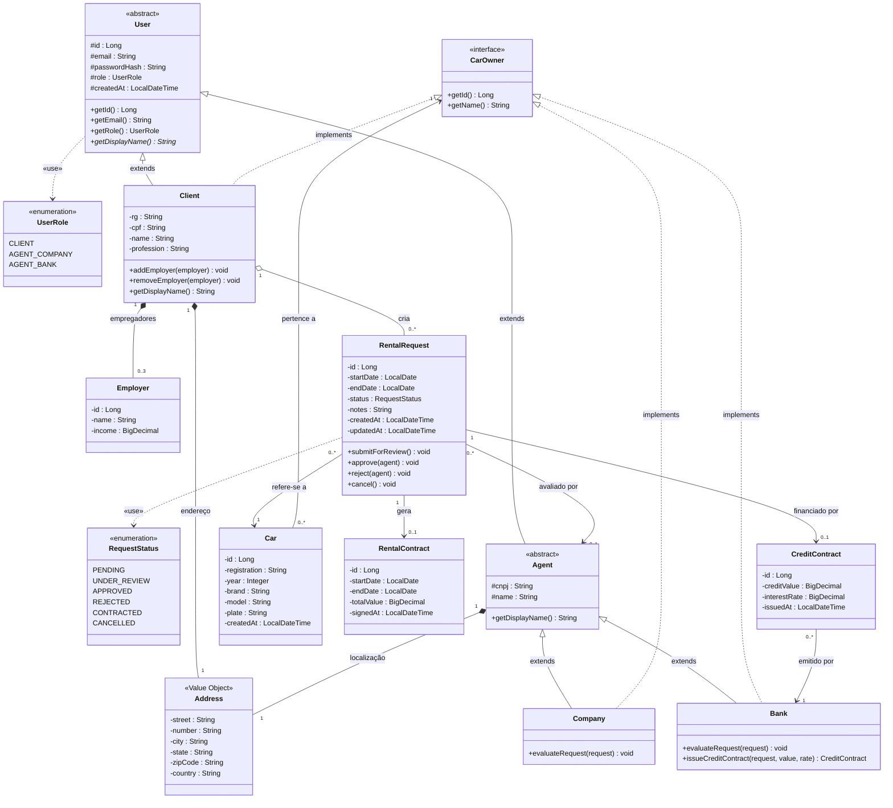
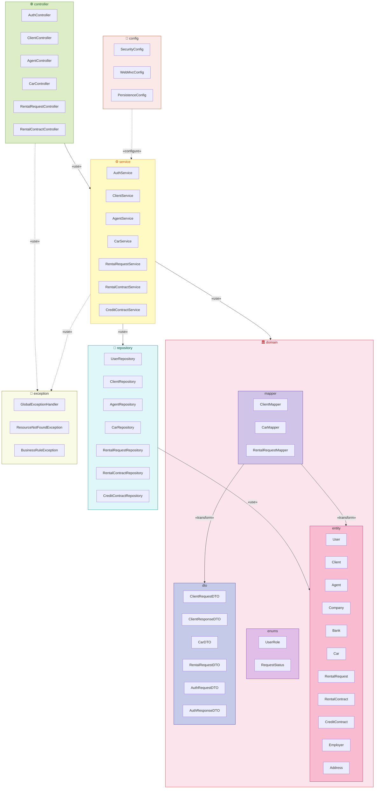
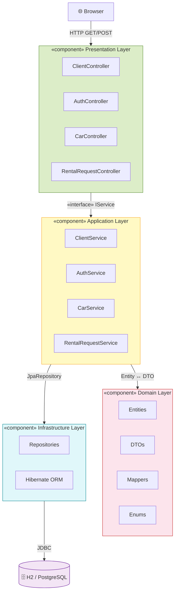
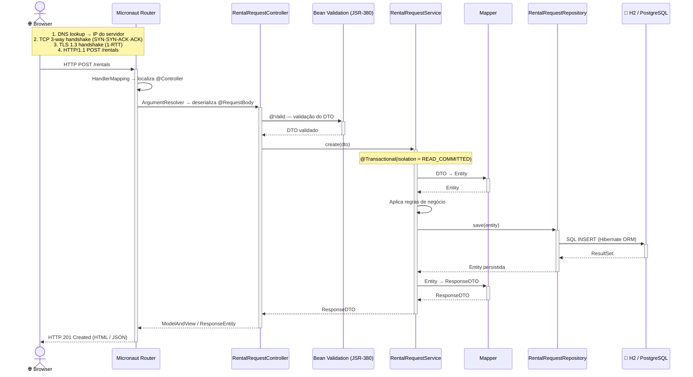
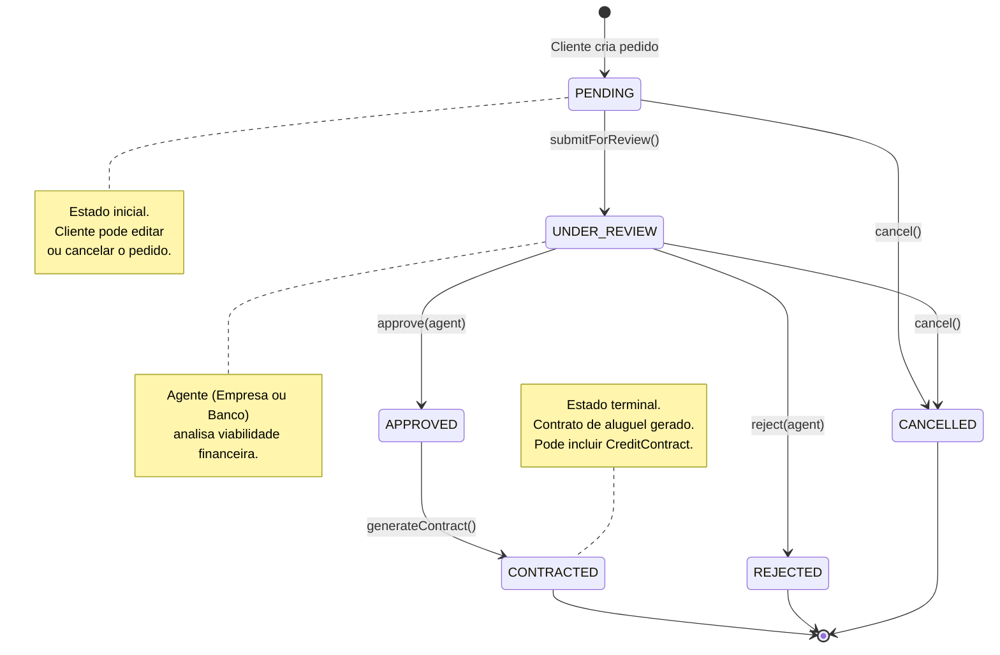

# 🚗 Car Rental System

> **Sistema Web de Gestão de Aluguel de Automóveis**  
> Permite que clientes realizem, modifiquem, consultem e cancelem pedidos de aluguel — enquanto agentes (empresas e bancos) analisam e aprovam contratos — tudo via Internet.

<table>
  <tr>
    <td width="820px">
      <div align="justify">
        O <b>Car Rental System</b> é um sistema web desenvolvido em <b>Java 21 + Micronaut 4</b> com arquitetura <b>MVC em camadas</b>. O projeto modela todo o ciclo de vida de um pedido de aluguel: do cadastro do cliente à assinatura do contrato, incluindo a possibilidade de financiamento via contrato de crédito emitido por bancos agentes. O sistema segue princípios de <i>Clean Architecture</i> (Uncle Bob), <i>Domain-Driven Design</i> (Evans) e padrões GoF, garantindo alta coesão, baixo acoplamento e testabilidade.
      </div>
    </td>
    <td>
      <div align="center">
        🏎️<br/>
        <sub><b>Car Rental System</b><br/>PUC Minas · ES</sub>
      </div>
    </td>
  </tr>
</table>

---

## 🚧 Status do Projeto


[](./pom.xml)
[](./)

---

## 📚 Índice

- [Sobre o Projeto](#-sobre-o-projeto)
- [Funcionalidades Principais](#-funcionalidades-principais)
- [Arquitetura](#-arquitetura)
  - [Visão em Camadas (MVC)](#visão-em-camadas-mvc)
  - [Diagrama de Classes](#diagrama-de-classes)
  - [Diagrama de Pacotes](#diagrama-de-pacotes)
  - [Diagrama de Componentes](#diagrama-de-componentes)
  - [Fluxo de Dados e Rede](#fluxo-de-dados-e-rede)
  - [Segurança](#segurança-tlsauth)
  - [Consistência de Dados e Trade-offs](#consistência-de-dados-e-trade-offs)
- [Modelo de Domínio](#-modelo-de-domínio)
  - [Entidades Principais](#entidades-principais)
  - [Máquina de Estados do Pedido](#máquina-de-estados-do-pedido)
- [Tecnologias Utilizadas](#-tecnologias-utilizadas)
- [Estrutura do Projeto](#-estrutura-do-projeto)
- [Instalação e Execução](#-instalação-e-execução)
  - [Pré-requisitos](#pré-requisitos)
  - [Variáveis de Ambiente](#variáveis-de-ambiente)
  - [Executando Localmente](#executando-localmente)
- [Roadmap de Sprints](#-roadmap-de-sprints)
- [Testes](#-testes)
- [Contribuição](#-contribuição)
- [Referências Técnicas](#-referências-técnicas)
- [Licença](#-licença)

---

## 🎯 Sobre o Projeto

O sistema foi concebido para atender às necessidades de **três tipos de atores**:

| Ator | Papel no Sistema |
|------|-----------------|
| **Cliente** (pessoa física) | Cadastra-se, cria/modifica/cancela pedidos de aluguel |
| **Agente Empresa** | Avalia pedidos financeiramente; pode ser proprietária de veículos |
| **Agente Banco** | Avalia pedidos financeiramente; emite contratos de crédito; pode ser proprietário de veículos |

> **Caso de uso central:** Um cliente autenticado seleciona um veículo disponível, submete um pedido de aluguel → um agente (empresa ou banco) analisa o pedido → se aprovado, o contrato é gerado (podendo conter um contrato de crédito bancário) → o veículo é formalmente registrado sob a propriedade acordada.

---

## ✨ Funcionalidades Principais

- [x] Cadastro, autenticação e gerenciamento de usuários (clientes e agentes)
- [x] CRUD completo de automóveis (matrícula, ano, marca, modelo, placa)
- [x] Criação, modificação, consulta e cancelamento de pedidos de aluguel
- [x] Workflow de aprovação/rejeição por agentes
- [x] Associação de contrato de crédito bancário a um pedido
- [x] Registro de empregadores do cliente (até 3, com rendimento)
- [x] Propriedade polimórfica do veículo (cliente, empresa ou banco)
- [x] Controle de acesso por perfil (Micronaut Security)

---

## 🏗️ Arquitetura

### Visão em Camadas (MVC)

A aplicação segue o padrão **MVC (Model-View-Controller)** implementado sobre o **Micronaut HTTP**, com separação explícita em 5 camadas lógicas. A regra de dependência flui em **uma única direção** — de fora para dentro — conforme prescrito pela *Clean Architecture* (Martin, 2017):



> **Por que não colocar lógica no Controller?** O Controller é o ponto de entrada HTTP. Colocar regras ali viola o SRP (Single Responsibility Principle) e dificulta testes unitários — a lógica precisa de um contexto HTTP para ser exercitada. Ao delegar ao Service, o mesmo caso de uso pode ser invocado via HTTP, filas de mensagens ou testes sem qualquer acoplamento ao protocolo.

---

### Diagrama de Classes

> 📐 Diagrama completo com notas arquiteturais: [`src/docs/diagrams/class-diagram.md`](src/docs/diagrams/class-diagram.md)



---

### Diagrama de Pacotes

> 📦 Diagrama completo com notas arquiteturais: [`src/docs/diagrams/package-diagram.md`](src/docs/diagrams/package-diagram.md)



> A separação `entity` vs `dto` segue o princípio de que **entidades de domínio nunca devem ser expostas diretamente na API** — evita over-fetching, coupling e vulnerabilidades de mass assignment. DTOs são contratos de API versionáveis independentemente do modelo de persistência.

---

### Diagrama de Componentes

> 🧩 Diagrama completo com notas arquiteturais: [`src/docs/diagrams/component-diagram.md`](src/docs/diagrams/component-diagram.md)



> O Diagrama de Componentes detalha as interfaces providas e requeridas por cada componente, o mapeamento componente → tecnologia, e a justificativa arquitetural baseada nos princípios SOLID (DIP, SRP) e padrões GoF (Facade, Repository).

---

### Fluxo de Dados e Rede

#### Caminho de uma requisição HTTP (end-to-end)



> **Gargalo de rede identificado:** Em alta carga, o pool de conexões JDBC (padrão HikariCP no Micronaut) é o primeiro ponto de contenção — não a rede TCP. O HikariCP recomenda `maximumPoolSize = (núcleos × 2) + discos_spindle` para cargas OLTP (Brettauer, HikariCP Wiki). Em produção, monitorar `hikari.pool.active` via Micrometer/Actuator.

---

### Segurança (TLS/Auth)

| Camada | Mecanismo | Justificativa |
|--------|-----------|---------------|
| **Transporte** | TLS 1.3 (HTTPS obrigatório) | Confidencialidade e integridade dos dados em trânsito (RFC 8446). TLS 1.3 elimina cipher suites inseguros (RC4, 3DES) e reduz handshake para 1-RTT. |
| **Autenticação** | Micronaut Security + Session-based Auth (ou JWT Bearer) | Session cookies com `HttpOnly` + `Secure` + `SameSite=Strict` previnem XSS e CSRF simultaneamente. JWT para APIs stateless em caso de expansão. |
| **Autorização** | RBAC via `UserRole` + `@PreAuthorize` | Separação explícita de permissões: `CLIENT` opera sobre seus próprios recursos; `AGENT_*` operam sobre pedidos em revisão. |
| **CSRF** | Micronaut Security CSRF Token | Padrão sincronizador de token (OWASP CSRF Prevention CS). |
| **Senhas** | BCrypt (fator de custo ≥ 12) | Adaptive hashing — torna ataques de força bruta computacionalmente inviáveis mesmo com GPU clusters (NIST SP 800-63B). |
| **Dados Sensíveis** | CPF/RG mascarados em logs e DTOs | PII não deve aparecer em stack traces ou responses de listagem (LGPD, Art. 46). |

---

### Consistência de Dados e Trade-offs

O sistema adota **consistência forte** (ACID) via transações relacionais — a escolha correta para um sistema financeiro/contratual:

| Decisão | Alternativa rejeitada | Motivo da escolha |
|---------|----------------------|-------------------|
| **RDBMS (H2/PostgreSQL)** | NoSQL (MongoDB) | Contratos exigem atomicidade multi-entidade (ex: aprovar pedido + gerar contrato + atualizar status do carro em uma única transação). Em bancos de documentos, isso requer transações distribuídas de alta complexidade. |
| **@Transactional READ_COMMITTED** | SERIALIZABLE | `SERIALIZABLE` evita anomalias de leitura fantasma, mas degrada throughput. No nosso domínio, o status do pedido é a variável crítica; seu controle via FSM no Service já previne transições inválidas concorrentes com um `SELECT FOR UPDATE` pontual. |
| **Máquina de estados no Service** | Flags booleanos no banco | O padrão State (GoF) no Service garante que transições inválidas lancem `BusinessRuleException` antes de qualquer escrita. Flags booleanos criam combinações impossíveis de estados. |
| **1 servidor central + clientes via Internet** | Arquitetura federada | Simplicidade operacional para o escopo atual. O servidor central com escalabilidade vertical é suficiente. Escalabilidade horizontal (load balancer + réplicas de leitura) é um caminho natural de evolução. |

> **Referência:** Kleppmann, M. (2017). *Designing Data-Intensive Applications*, Cap. 7 — Transactions. O'Reilly. A escolha de isolamento deve ser calibrada às anomalias aceitáveis de cada caso de uso, não maximizada cegamente.

---

## 🗂️ Modelo de Domínio

### Entidades Principais

| Entidade | Responsabilidade | Atributos-chave |
|----------|-----------------|-----------------|
| `User` | Raiz abstrata de autenticação | `id`, `email`, `passwordHash`, `role` |
| `Client` | Pessoa física contratante | `cpf`, `rg`, `name`, `profession`, `address`, `employers (0..3)` |
| `Agent` | Entidade avaliadora (abstrata) | `cnpj`, `name`, `address` |
| `Company` | Empresa agente | herda de `Agent` |
| `Bank` | Banco agente | herda de `Agent`; emite `CreditContract` |
| `Car` | Automóvel a ser alugado | `registration`, `year`, `brand`, `model`, `plate` |
| `RentalRequest` | Pedido de aluguel (FSM) | `status`, `startDate`, `endDate`, `car`, `client`, `agent` |
| `RentalContract` | Contrato formalizado | `totalValue`, `startDate`, `endDate`, `signedAt` |
| `CreditContract` | Contrato de crédito bancário | `creditValue`, `interestRate`, `issuedBy (Bank)` |
| `Employer` | Empregador do cliente | `name`, `income` |
| `Address` | Value Object de endereço | `street`, `city`, `state`, `zipCode` |

### Máquina de Estados do Pedido



> Transições inválidas lançam `BusinessRuleException(HTTP 422)`. A validação acontece **antes** de qualquer escrita no banco.

---

## 🛠️ Tecnologias Utilizadas

| Tecnologia | Versão | Papel |
|-----------|--------|-------|
| Java | 21 (LTS) | Linguagem principal; virtual threads (Project Loom) disponíveis |
| Micronaut | 4.0.4 | Framework web, IoC container, Auto-configuration |
| Micronaut HTTP | 4.x | Camada de apresentação HTTP (Netty server) |
| Micronaut Security | 4.x | Autenticação, autorização, session management |
| Micronaut Data JPA | 4.x | Abstração de persistência — compile-time query generation |
| Hibernate ORM | 6.x | Mapeamento objeto-relacional, geração de DDL |
| Thymeleaf | 3.1 | Template engine server-side (HTML natural, sem JS obrigatório) |
| H2 Database | 2.x | Banco em memória para desenvolvimento e testes |
| PostgreSQL | 15+ | Banco relacional para ambiente de produção |
| Maven | 3.9 | Build, gestão de dependências, ciclo de vida |
| JUnit 5 | 5.x | Testes unitários e de integração |
| Lombok | 1.18 | Redução de boilerplate (getters, setters, builders) |
| Mermaid | — | Diagramas UML como código — padrão corporativo renderizado nativamente pelo GitHub |

---

## 📁 Estrutura do Projeto

```
car-rental-system/
├── src/
│   ├── main/
│   │   ├── java/com/pucminas/car_rental_system/
│   │   │   ├── CarRentalSystemApplication.java        ← Entry point
│   │   │   ├── controller/
│   │   │   │   ├── HomeController.java                ← Redirect / → /clients
│   │   │   │   └── ClientController.java              ← CRUD MVC (Sprint 02) ✅
│   │   │   ├── domain/
│   │   │   │   ├── entity/
│   │   │   │   │   ├── User.java                      ← @Entity abstrata (JOINED)
│   │   │   │   │   ├── Client.java                    ← @Entity (Sprint 02) ✅
│   │   │   │   │   ├── Address.java                   ← @Embeddable Value Object
│   │   │   │   │   └── Employer.java                  ← @Entity (composição)
│   │   │   │   ├── enums/
│   │   │   │   │   ├── UserRole.java
│   │   │   │   │   └── RequestStatus.java
│   │   │   │   ├── dto/
│   │   │   │   │   ├── ClientRequestDTO.java          ← DTO de entrada (formulário)
│   │   │   │   │   ├── ClientResponseDTO.java         ← DTO de saída (listagem/detalhe)
│   │   │   │   │   ├── AddressDTO.java
│   │   │   │   │   └── EmployerDTO.java
│   │   │   │   └── mapper/
│   │   │   │       └── ClientMapper.java              ← Entity ↔ DTO bidirecional
│   │   │   ├── repository/
│   │   │   │   └── ClientRepository.java              ← JpaRepository + custom queries
│   │   │   ├── service/
│   │   │   │   └── ClientService.java                 ← Facade + regras de negócio
│   │   │   └── exception/
│   │   │       ├── GlobalExceptionHandler.java        ← @Error handlers (Micronaut)
│   │   │       ├── ResourceNotFoundException.java     ← HTTP 404
│   │   │       └── BusinessRuleException.java         ← HTTP 422
│   │   └── resources/
│   │       ├── application.yml                        ← Config H2 + JPA + Thymeleaf
│   │       ├── static/
│   │       │   └── css/
│   │       │       └── style.css                      ← Design System CSS
│   │       └── templates/
│   │           ├── layout/
│   │           │   └── base.html                      ← Layout compartilhado
│   │           ├── client/
│   │           │   ├── list.html                      ← Listagem de clientes
│   │           │   ├── detail.html                    ← Detalhes do cliente
│   │           │   └── form.html                      ← Criar/Editar cliente
│   │           └── error/
│   │               ├── 404.html
│   │               ├── 422.html
│   │               └── 500.html
│   ├── test/
│   │   └── java/com/pucminas/car_rental_system/
│   │       └── CarRentalSystemApplicationTests.java
│   └── docs/
│       ├── LABORATÓRIO 02 - Sistema de Aluguel de Carros.pdf
│       └── diagrams/
│           ├── class-diagram.md           ← Diagrama de Classes v2.0
│           ├── package-diagram.md         ← Diagrama de Pacotes v2.0
│           ├── component-diagram.md       ← Diagrama de Componentes (Sprint 02) ✅
│           ├── use-cases-diagram.png      ← Diagrama de Casos de Uso
│           └── user-histories.md          ← Histórias de Usuário
├── pom.xml
├── README.md
└── CONTRIBUTING.md
```

---

## ⚙️ Instalação e Execução

### Pré-requisitos

| Ferramenta | Versão mínima | Verificação |
|-----------|--------------|-------------|
| JDK | 21 | `java -version` |
| Maven | 3.9 | `mvn -version` |
| Git | 2.x | `git --version` |


```bash
# 1. Clone o repositório
git clone https://github.com/seu-usuario/car-rental-system.git
cd car-rental-system

# 2. Compile e execute os testes
./mvnw clean verify

# 3. Inicie a aplicação (perfil dev — banco H2 em memória)
./mvnw mn:run

# 4. Acesse no navegador
#    Aplicação: http://localhost:8080
#    Console H2: http://localhost:8080/h2-console
```

---

## 🗺️ Roadmap de Sprints

| Sprint | Entregáveis | Status |
|--------|-------------|--------|
| **Sprint 01** | Diagrama de Casos de Uso · Histórias de Usuário · Diagrama de Classes · Diagrama de Pacotes | ✅ Concluída |
| **Sprint 02** | Revisão dos diagramas (v2.0) · Diagrama de Componentes · CRUD de Cliente (Web MVC + JPA + H2) | 🟡 Em andamento |
| **Sprint 03** | Revisão dos diagramas · Diagrama de Implantação · Protótipo (criar/visualizar pedidos) | ⬜ Pendente |

---

## 🧪 Testes

```bash
# Executar todos os testes
./mvnw test

# Relatório de cobertura (JaCoCo)
./mvnw verify
open target/site/jacoco/index.html
```

**Estratégia de testes:**

| Tipo | Escopo | Framework |
|------|--------|-----------|
| Unitário | Service + Domain logic | JUnit 5 + Mockito |
| Integração | Repository + Controller | `@MicronautTest` + H2 |
| Contrato | API endpoints | MockMvc |

> Regra: cobertura mínima de **80%** nas classes de `service/` e `domain/`. Controllers e configurações são cobertos pelos testes de integração.

---

## 🤝 Contribuição

Consulte o [CONTRIBUTING.md](CONTRIBUTING.md) para o guia completo de contribuição, convenção de commits e checklist de Pull Request.

---

## 📖 Referências Técnicas

- **Martin, R.C.** (2017). *Clean Architecture: A Craftsman's Guide to Software Structure and Design*. Prentice Hall.
- **Kleppmann, M.** (2017). *Designing Data-Intensive Applications*. O'Reilly. (Cap. 7 – Transactions; Cap. 12 – The Future of Data Systems)
- **Evans, E.** (2003). *Domain-Driven Design: Tackling Complexity in the Heart of Software*. Addison-Wesley.
- **Gamma, E. et al.** (1994). *Design Patterns: Elements of Reusable Object-Oriented Software*. Addison-Wesley. (GoF)
- **Fowler, M.** (2002). *Patterns of Enterprise Application Architecture*. Addison-Wesley. (Repository, Service Layer, MVC)
- **RFC 8446** — The Transport Layer Security (TLS) Protocol Version 1.3. IETF.
- **RFC 7807** — Problem Details for HTTP APIs. IETF.
- **NIST SP 800-63B** — Digital Identity Guidelines: Authentication and Lifecycle Management.
- **Mermaid Documentation** — https://mermaid.js.org/intro/ — Diagrams as Code (padrão corporativo).
- **Micronaut Documentation** — https://docs.micronaut.io/latest/guide/
- **Micronaut Security Reference** — https://micronaut-projects.github.io/micronaut-security/latest/guide/

---

## 📄 Licença

Este projeto é desenvolvido para fins acadêmicos no curso de **Engenharia de Software — PUC Minas**.  
Disciplina: **Laboratório de Desenvolvimento de Software**  
Professor: **João Paulo Carneiro Aramuni**

---

<div align="center">
  Feito com ☕ e ❤️ pela equipe Car Rental System · PUC Minas · 2026
</div>

