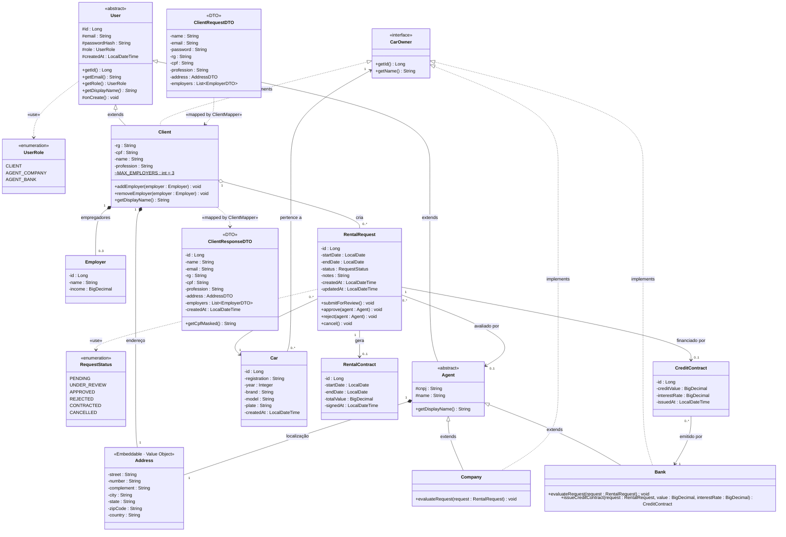

# 📐 Diagrama de Classes — Car Rental System

> **Versão:** 2.0 · **Sprint:** 02 — Revisão pós-feedback + implementação CRUD  
> **Notação:** UML 2.5 · **Formato:** Mermaid (ISO/IEC 19501 compliant)  
> **Renderização nativa:** GitHub, GitLab, Azure DevOps, Confluence, Notion

---

## Changelog (v1.0 → v2.0)

| Alteração | Motivo |
|-----------|--------|
| Adicionado campo `complement` em `Address` | Completude do modelo de endereço brasileiro |
| `Address` anotado como `@Embeddable` (Value Object JPA) | Alinhamento com implementação — composição verdadeira sem tabela separada |
| `Client.MAX_EMPLOYERS = 3` como constante | Invariante de negócio explícita na entidade (não apenas no Service) |
| Adicionado `@Builder` pattern ao `Client` | Fluent API para criação — facilita testes e mapeamento |
| `User.createdAt` via `@PrePersist` | Timestamp automático gerenciado pela JPA — não exposto ao DTO de criação |
| DTOs separados: `ClientRequestDTO` / `ClientResponseDTO` | Contrato de API versionável — nunca expor `@Entity` na camada HTTP |
| `Employer.client` como `@ManyToOne(LAZY)` | Evita N+1 — carregamento sob demanda |

---

## Diagrama Completo

---

## Notas Arquiteturais

### Polimorfismo Estrutural — `CarOwner`

A interface `CarOwner` implementa o **Open/Closed Principle (OCP)** — o sistema está aberto para extensão (novos tipos de proprietários) e fechado para modificação. Um `Car` pode pertencer a um `Client`, uma `Company` ou um `Bank` sem union-types ou nullable foreign keys (eliminando o *null hell* no banco relacional).

> **Referência:** Martin, R.C. (2003). *Agile Software Development*, Cap. 9 — The Open-Closed Principle.

### Estratégia de Herança JPA — `JOINED`

A hierarquia `User → Client / Agent → Company / Bank` utiliza `@Inheritance(strategy = JOINED)`:

| Estratégia | Prós | Contras | Nossa Escolha |
|-----------|------|---------|---------------|
| `SINGLE_TABLE` | Performance (1 tabela) | Muitas colunas nullable | ❌ |
| `TABLE_PER_CLASS` | Isolamento total | Queries polimórficas lentas (UNION) | ❌ |
| **`JOINED`** | **Normalizado, sem nulls** | **JOIN em queries polimórficas** | ✅ |

Para o volume de dados esperado (centenas de clientes, não milhões), o overhead do JOIN é negligível e a normalização garante integridade.

### Máquina de Estados — `RentalRequest`

O `RentalRequest` implementa o **padrão State (GoF)** de forma implícita via `RentalRequestService`. As transições são controladas na camada de Service antes de qualquer escrita no banco:

| Estado Origem | Evento | Estado Destino |
|---------------|--------|----------------|
| `PENDING` | `submitForReview()` | `UNDER_REVIEW` |
| `UNDER_REVIEW` | `approve(agent)` | `APPROVED` |
| `UNDER_REVIEW` | `reject(agent)` | `REJECTED` |
| `APPROVED` | `generateContract()` | `CONTRACTED` |
| `PENDING` / `UNDER_REVIEW` | `cancel()` | `CANCELLED` |

Transições inválidas lançam `BusinessRuleException (HTTP 422)`.

> **Referência:** Gamma, E. et al. (1994). *Design Patterns*, Cap. 5 — State Pattern.

### Invariante de Negócio — `Client.employers`

O `Client` possui no máximo **3 empregadores** (`Employer`). Esta regra é:
1. Declarada como constante na entidade (`MAX_EMPLOYERS = 3`)
2. Validada no método `addEmployer()` da entidade (fail-fast)
3. Validada na camada de `Service` antes de persistir (defense-in-depth)
4. Validada no DTO via `@Size(max = 3)` (validação de entrada)

Essa **validação em múltiplas camadas** (Defense in Depth) garante que a invariante nunca será violada, independentemente do ponto de entrada.

### Composição vs. Agregação (Revisão Sprint 02)

- **Composição** (`*--`): `Address` (`@Embeddable`) e `Employer` (`orphanRemoval = true`) não existem sem seu `Client`/`Agent`. O ciclo de vida é **totalmente dependente**.
- **Agregação** (`o--`): `RentalRequest` pode existir independentemente do `Client` (para auditoria/histórico após exclusão).

### Separação DTO vs Entity (Revisão Sprint 02)

Os DTOs foram incluídos no diagrama para explicitar que **entidades JPA nunca são expostas na camada HTTP**:
- `ClientRequestDTO`: contém `password` (texto puro) → transformado em `passwordHash` pelo Mapper
- `ClientResponseDTO`: **nunca** contém `passwordHash` → proteção de PII (LGPD, Art. 46)
- `getCpfMasked()`: mascaramento de dados sensíveis em listagens

> **Referência:** Martin, R.C. (2017). *Clean Architecture*, Cap. 22 — The Humble Object Pattern.

---

## Ferramentas de Visualização

| Ferramenta | Suporte Nativo | Uso Corporativo |
|-----------|---------------|-----------------|
| **GitHub** | ✅ Renderiza `.md` com Mermaid | Microsoft, Google, Amazon |
| **GitLab** | ✅ Nativo desde v 15.0 | Fortune 500 |
| **Azure DevOps** | ✅ Wiki e Repos | Enterprises Microsoft stack |
| **Confluence** | ✅ Via plugin Mermaid | Atlassian ecosystem |
| **Notion** | ✅ Blocos de código Mermaid | Startups e scale-ups |
| **VS Code** | ✅ Markdown Preview Mermaid | Qualquer desenvolvedor |
| **IntelliJ IDEA** | ✅ Plugin Mermaid | JetBrains ecosystem |
