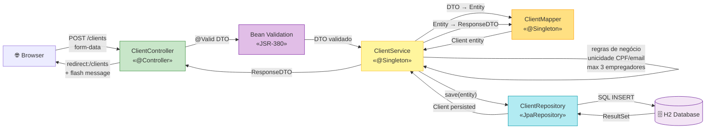

# 🧩 Diagrama de Componentes — Car Rental System

> **Versão:** 2.0 · **Sprint:** 02  
> **Notação:** UML 2.5 — Component Diagram · **Formato:** Mermaid  
> **Renderização nativa:** GitHub, GitLab, Azure DevOps, Confluence, Notion

---

## Visão Geral dos Componentes do Sistema

O diagrama abaixo representa a arquitetura de componentes do sistema, seguindo os princípios da **Clean Architecture** (Martin, 2017). Cada componente encapsula uma responsabilidade coesa e expõe interfaces bem definidas — garantindo baixo acoplamento e alta testabilidade.

```mermaid
flowchart TB
    %% ════════════════════════════════════════════════════════
    %%  ATORES EXTERNOS
    %% ════════════════════════════════════════════════════════

    BROWSER["🌐 Browser do Usuário<br/><i>HTML5 · CSS3 · HTTP/1.1</i>"]

    %% ════════════════════════════════════════════════════════
    %%  COMPONENTE: PRESENTATION LAYER
    %% ════════════════════════════════════════════════════════

    subgraph PRESENTATION["«component» Presentation Layer"]
        direction LR

        subgraph CONTROLLERS["«component» Controllers"]
            direction TB
            CC["«component»<br/><b>ClientController</b><br/><i>CRUD de clientes</i>"]
            AC["«component»<br/><b>AuthController</b><br/><i>Login/Logout</i>"]
            CarC["«component»<br/><b>CarController</b><br/><i>Gestão de veículos</i>"]
            RRC["«component»<br/><b>RentalRequestController</b><br/><i>Pedidos de aluguel</i>"]
            RCC["«component»<br/><b>RentalContractController</b><br/><i>Contratos</i>"]
        end

        subgraph VIEWS["«component» View Engine"]
            direction TB
            TH["«component»<br/><b>Thymeleaf Templates</b><br/><i>Server-Side Rendering</i>"]
            STATIC["«component»<br/><b>Static Assets</b><br/><i>CSS · JS</i>"]
        end
    end

    %% ════════════════════════════════════════════════════════
    %%  COMPONENTE: APPLICATION LAYER
    %% ════════════════════════════════════════════════════════

    subgraph APPLICATION["«component» Application Layer"]
        direction LR

        subgraph SERVICES["«component» Services"]
            direction TB
            CS["«component»<br/><b>ClientService</b><br/><i>Casos de uso de cliente</i>"]
            AS["«component»<br/><b>AuthService</b><br/><i>Autenticação</i>"]
            CarS["«component»<br/><b>CarService</b><br/><i>Casos de uso de veículo</i>"]
            RRS["«component»<br/><b>RentalRequestService</b><br/><i>FSM de pedidos</i>"]
            RCS["«component»<br/><b>RentalContractService</b><br/><i>Geração de contratos</i>"]
            CCS["«component»<br/><b>CreditContractService</b><br/><i>Contratos de crédito</i>"]
        end

        subgraph MAPPERS["«component» Mappers"]
            direction TB
            CM["«component»<br/><b>ClientMapper</b><br/><i>Entity ↔ DTO</i>"]
            CarM["«component»<br/><b>CarMapper</b><br/><i>Entity ↔ DTO</i>"]
            RRM["«component»<br/><b>RentalRequestMapper</b><br/><i>Entity ↔ DTO</i>"]
        end
    end

    %% ════════════════════════════════════════════════════════
    %%  COMPONENTE: DOMAIN LAYER
    %% ════════════════════════════════════════════════════════

    subgraph DOMAIN["«component» Domain Layer"]
        direction LR

        subgraph ENTITIES["«component» Entities"]
            direction TB
            ENT_USER["User · Client · Agent<br/>Company · Bank"]
            ENT_CAR["Car · Employer · Address"]
            ENT_REQ["RentalRequest<br/>RentalContract<br/>CreditContract"]
        end

        subgraph ENUMS_C["«component» Enums"]
            direction TB
            ENUM_ROLE["UserRole"]
            ENUM_STATUS["RequestStatus"]
        end

        subgraph DTOS["«component» DTOs"]
            direction TB
            DTO_CLIENT["ClientRequestDTO<br/>ClientResponseDTO"]
            DTO_OTHER["CarDTO · RentalRequestDTO<br/>AuthRequestDTO · AuthResponseDTO"]
        end
    end

    %% ════════════════════════════════════════════════════════
    %%  COMPONENTE: INFRASTRUCTURE LAYER
    %% ════════════════════════════════════════════════════════

    subgraph INFRASTRUCTURE["«component» Infrastructure Layer"]
        direction LR

        subgraph REPOS["«component» Repositories"]
            direction TB
            CR["«component»<br/><b>ClientRepository</b>"]
            UR["«component»<br/><b>UserRepository</b>"]
            CarR["«component»<br/><b>CarRepository</b>"]
            RRR["«component»<br/><b>RentalRequestRepository</b>"]
            RCR["«component»<br/><b>RentalContractRepository</b>"]
            CCR["«component»<br/><b>CreditContractRepository</b>"]
        end

        subgraph ORM["«component» ORM"]
            direction TB
            HIB["«component»<br/><b>Hibernate ORM</b><br/><i>JPA Implementation</i>"]
            HIKARI["«component»<br/><b>HikariCP</b><br/><i>Connection Pool</i>"]
        end
    end

    %% ════════════════════════════════════════════════════════
    %%  COMPONENTE: CROSS-CUTTING
    %% ════════════════════════════════════════════════════════

    subgraph CROSSCUT["«component» Cross-Cutting Concerns"]
        direction LR

        subgraph CONFIG["«component» Configuration"]
            SC["SecurityConfig"]
            WMC["WebMvcConfig"]
            PC["PersistenceConfig"]
        end

        subgraph EXCEPTIONS["«component» Exception Handling"]
            GEH["GlobalExceptionHandler"]
            RNF["ResourceNotFoundException"]
            BRE["BusinessRuleException"]
        end
    end

    %% ════════════════════════════════════════════════════════
    %%  COMPONENTE EXTERNO: BANCO DE DADOS
    %% ════════════════════════════════════════════════════════

    DB[("🗄️ Database<br/><b>H2</b> (dev) · <b>PostgreSQL</b> (prod)<br/><i>JDBC · SQL</i>")]

    %% ════════════════════════════════════════════════════════
    %%  INTERFACES E DEPENDÊNCIAS
    %% ════════════════════════════════════════════════════════

    BROWSER -- "HTTP Request<br/>GET · POST" --> CONTROLLERS
    CONTROLLERS -- "ModelAndView" --> VIEWS
    VIEWS -- "HTTP Response<br/>HTML rendered" --> BROWSER

    CONTROLLERS -- "«interface»<br/>IService" --> SERVICES
    SERVICES -- "«interface»<br/>IMapper" --> MAPPERS
    MAPPERS --> ENTITIES
    MAPPERS --> DTOS
    SERVICES -- "«interface»<br/>JpaRepository" --> REPOS
    SERVICES --> ENTITIES
    SERVICES --> ENUMS_C
    SERVICES --> DTOS

    REPOS --> ORM
    ORM -- "JDBC" --> DB

    CONFIG -. "«configure»" .-> SERVICES
    CONFIG -. "«configure»" .-> ORM
    EXCEPTIONS -. "«intercept»" .-> CONTROLLERS
    EXCEPTIONS -. "«intercept»" .-> SERVICES

    %% ════════════════════════════════════════════════════════
    %%  ESTILOS
    %% ════════════════════════════════════════════════════════

    style PRESENTATION fill:#DCEDC8,stroke:#558B2F,color:#1B5E20
    style CONTROLLERS fill:#C8E6C9,stroke:#388E3C
    style VIEWS fill:#A5D6A7,stroke:#2E7D32
    style APPLICATION fill:#FFF9C4,stroke:#F9A825,color:#E65100
    style SERVICES fill:#FFF59D,stroke:#FBC02D
    style MAPPERS fill:#FFE082,stroke:#FFA000
    style DOMAIN fill:#FCE4EC,stroke:#C62828,color:#B71C1C
    style ENTITIES fill:#F8BBD0,stroke:#AD1457
    style ENUMS_C fill:#E1BEE7,stroke:#7B1FA2
    style DTOS fill:#C5CAE9,stroke:#283593
    style INFRASTRUCTURE fill:#E0F7FA,stroke:#00838F,color:#004D40
    style REPOS fill:#B2EBF2,stroke:#0097A7
    style ORM fill:#80DEEA,stroke:#00838F
    style CROSSCUT fill:#FBE9E7,stroke:#BF360C
    style CONFIG fill:#FFCCBC,stroke:#E64A19
    style EXCEPTIONS fill:#FFE0B2,stroke:#F57C00
    style DB fill:#F3E5F5,stroke:#6A1B9A,color:#4A148C
```

---

## Diagrama de Componentes — Fluxo do CRUD de Cliente

Visão detalhada do fluxo de dados do CRUD de Cliente, implementado no Sprint 02:

---

## Interfaces Providas e Requeridas

| Componente | Interface Provida | Interface Requerida |
|-----------|------------------|-------------------|
| **ClientController** | `HTTP GET/POST /clients/**` | `ClientService` |
| **ClientService** | `IClientService` (create, findAll, findById, update, delete) | `ClientRepository`, `ClientMapper` |
| **ClientMapper** | `IClientMapper` (toEntity, toResponseDTO, toRequestDTO, updateEntity) | — |
| **ClientRepository** | `JpaRepository<Client, Long>` + custom queries | Hibernate ORM |
| **Thymeleaf Engine** | Server-rendered HTML | Template files + Model attributes |
| **GlobalExceptionHandler** | `@Error (Micronaut)` (intercepta exceções) | — |
| **SecurityConfig** | Micronaut Security Filter Chain | — |
| **HikariCP** | `DataSource` (connection pool) | JDBC Driver |

---

## Mapeamento Componente → Tecnologia

| Componente | Tecnologia / Framework | Justificativa |
|-----------|----------------------|---------------|
| Controllers | Micronaut HTTP `@Controller` | Front Controller pattern (Fowler, 2002). Roteamento HTTP declarativo. |
| Services | Micronaut `@Singleton` + `@Transactional` | Facade pattern (GoF). Orquestração de casos de uso com controle transacional. |
| Mappers | Micronaut `@Singleton` (manual) | Responsabilidade única de transformação. Alternativa: MapStruct (geração em compile-time). |
| Repositories | Micronaut Data JPA `JpaRepository` | Repository pattern (DDD — Evans). Abstrai persistência. |
| View Engine | Thymeleaf 3.1 | Natural templating — HTML válido sem servidor. SSR sem obrigatoriedade de JS. |
| ORM | Hibernate 6.x | JPA provider padrão do Micronaut. Mapeamento objeto-relacional. |
| Connection Pool | HikariCP | Pool JDBC de melhor performance (benchmarks Brettauer). Default do Micronaut. |
| Validation | Bean Validation (JSR-380) + Hibernate Validator | Validação declarativa via anotações. Separação de regras de formato vs regras de negócio. |
| Exception Handling | `@Error (Micronaut)` | Centralização do tratamento de erros (RFC 7807 em espírito). |

---

## Notas Arquiteturais

### Princípio de Inversão de Dependência (DIP — SOLID)

Os componentes de alto nível (Services) **não dependem** de componentes de baixo nível (Repositories) diretamente — dependem de abstrações (`JpaRepository<T, ID>` interface). Isso permite:

- **Substituição** do banco H2 por PostgreSQL sem alterar o Service
- **Testabilidade** — mock do Repository via Mockito em testes unitários
- **Evolução** — migração para outra implementação JPA (EclipseLink) sem impacto

### Coesão de Componentes (Common Closure Principle — CCP)

Classes que mudam juntas estão no mesmo componente:
- `ClientService` + `ClientMapper` + `ClientRequestDTO` + `ClientResponseDTO` → mudam quando o caso de uso "Cliente" evolui
- `GlobalExceptionHandler` + exceções específicas → mudam quando a política de erros evolui

### Acoplamento entre Componentes (Stable Dependencies Principle — SDP)

Componentes estáveis (Domain, Enums) são dependidos por componentes instáveis (Controllers, Services). A direção da dependência vai do **instável para o estável**, conforme prescrito por Martin (2017), Cap. 14 — Component Coupling.

---

## Referências

- **Martin, R.C.** (2017). *Clean Architecture*, Cap. 13–14 — Component Cohesion and Coupling. Prentice Hall.
- **Fowler, M.** (2002). *Patterns of Enterprise Application Architecture* — Front Controller, Service Layer, Repository. Addison-Wesley.
- **Gamma, E. et al.** (1994). *Design Patterns* — Facade, Observer, State. GoF.
- **Evans, E.** (2003). *Domain-Driven Design* — Repository Pattern, Value Objects. Addison-Wesley.

