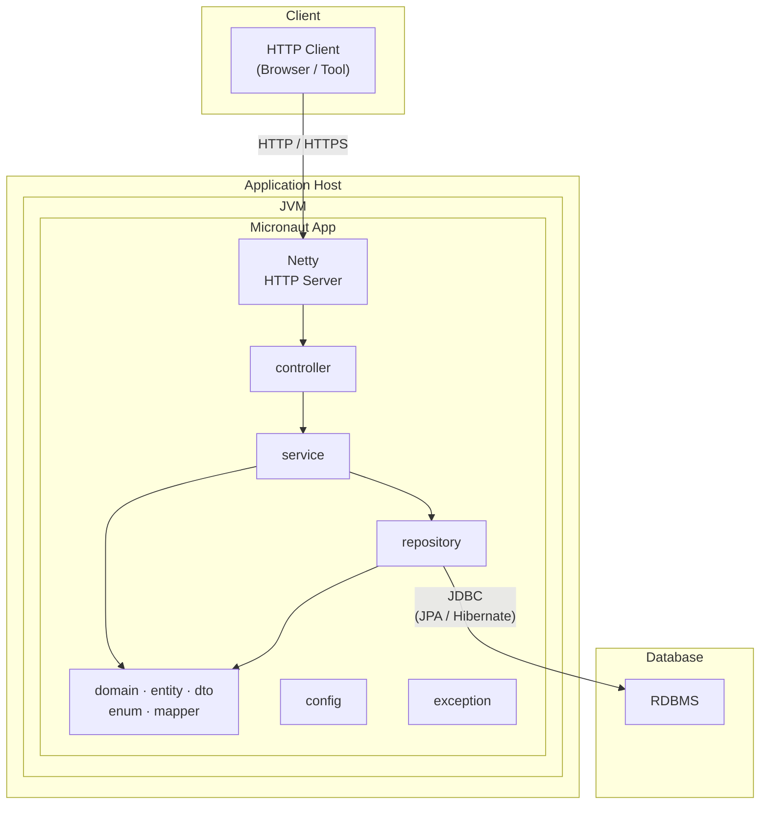

# 🚀 Diagrama de Implantação — Car Rental System

> **Versão:** 1.0 · **Sprint:** 01  
> **Arquitetura:** Micronaut · Monólito Modular · Clean Architecture  
> **Linguagem:** Java  
> **Servidor HTTP:** Netty (embedded)  
> **Persistência:** JPA com Hibernate (ORM)  
> **Notação:** UML 2.5  
> **Formato:** Mermaid (ISO/IEC 19501 compliant)  
> **Renderização nativa:** GitHub, GitLab, Azure DevOps, Confluence, Notion

## 🖼️ Objetivo

Este diagrama representa a **visão de implantação (deployment)** do *Car Rental System*, mostrando **como os componentes da aplicação são organizados e executados em tempo de execução**, bem como **as fronteiras físicas e lógicas do sistema**.

Diferente do diagrama de pacotes (que descreve a organização do código‑fonte), este diagrama foca em **onde cada parte do sistema roda**, **em que ambiente** e **como os nós se comunicam**.

---

## 🧭 Como ler o diagrama

O diagrama é organizado **de fora para dentro**, refletindo tanto a **topologia de execução** quanto o **fluxo principal de chamadas**:

1. **Client / Usuário**  
   Representa fontes externas de requisições HTTP, como navegadores ou ferramentas de integração.

2. **Host / Servidor de Aplicação**  
   Representa a infraestrutura onde o sistema é implantado (VM, container ou servidor físico).

3. **JVM (Java Virtual Machine)**  
   Indica que toda a aplicação é executada dentro de um único processo Java.

4. **Micronaut Application**  
   Representa o artefato executável que agrupa todas as camadas do sistema.

5. **Banco de Dados**  
   Nó externo responsável pela persistência relacional.

As setas indicam **fluxo de comunicação ou interação em tempo de execução**, e não dependências de código‑fonte.

---

## 🧱 Significado dos Nós Principais

### 🌐 Client

O nó **Client** simboliza qualquer consumidor externo da aplicação, como:

- Navegadores Web
- Clientes mobile
- Ferramentas de teste e integração HTTP

Este nó **não faz parte da aplicação implantada**, apenas interage com ela via HTTP/HTTPS.

---

### 🖥️ Host / JVM

O **Host** encapsula o ambiente físico ou virtual que hospeda a aplicação.

Dentro dele:
- A **JVM** representa o ambiente de execução Java.
- Todo o sistema executa dentro de **uma única JVM**, sem comunicação entre processos distintos.

---

### 🚀 Micronaut Application

Este nó representa o **monólito modular implantado**.

Embora implantada como um único artefato, a aplicação mantém uma separação clara entre responsabilidades, refletindo as camadas definidas no diagrama de pacotes:

- **controller** — camada de apresentação (entrada HTTP)
- **service** — camada de aplicação (casos de uso)
- **domain** — entidades, DTOs, enums e mappers
- **repository** — acesso à persistência
- **config** — configurações transversais
- **exception** — tratamento centralizado de erros

Essa representação evidencia que a modularização lógica é preservada mesmo em um deploy único.

---

### 🔌 Netty (Embedded HTTP Server)

O **Netty** aparece como parte interna da aplicação para deixar explícito que:

- O servidor HTTP é **embutido no runtime**
- Não existe servidor de aplicação externo
- O processamento HTTP ocorre no mesmo processo da JVM

---

### 🗄️ Banco de Dados

O **Banco de Dados** é representado como um nó separado, indicando:

- Uma fronteira clara entre aplicação e persistência
- Comunicação realizada via JDBC
- Ausência de acesso direto do Client ao banco

---

## 🔄 Fluxo representado no diagrama

O diagrama descreve o seguinte fluxo típico de execução:

1. O **Client** envia uma requisição HTTP
2. O **Netty** recebe e gerencia a conexão
3. A requisição é encaminhada para a camada **controller**
4. A camada **service** executa o caso de uso
5. A camada **repository** acessa o banco de dados
6. O resultado retorna pelo mesmo caminho até o Client

---
