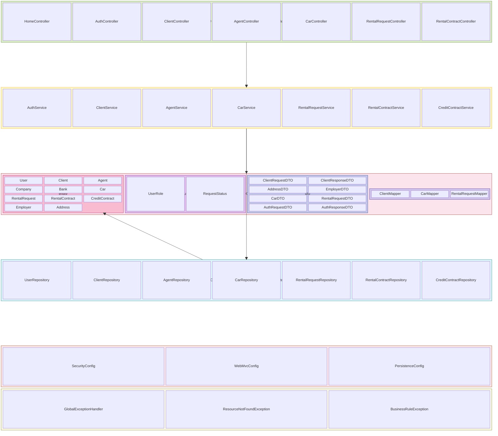
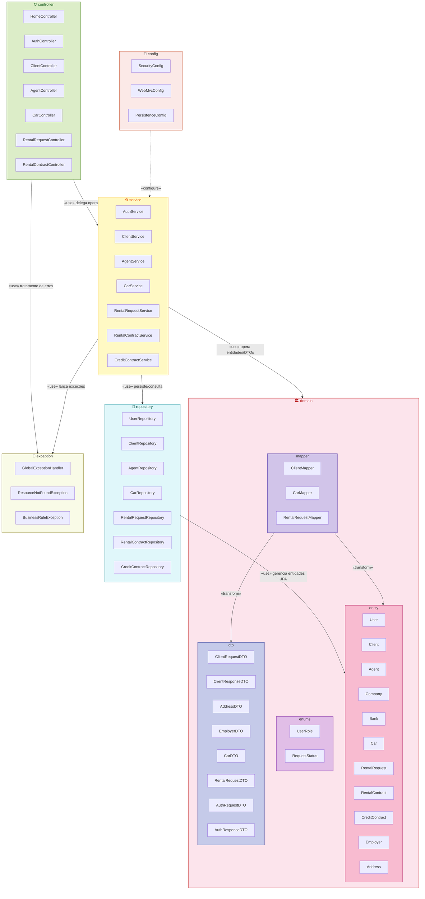
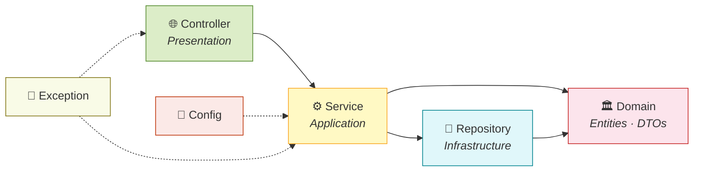
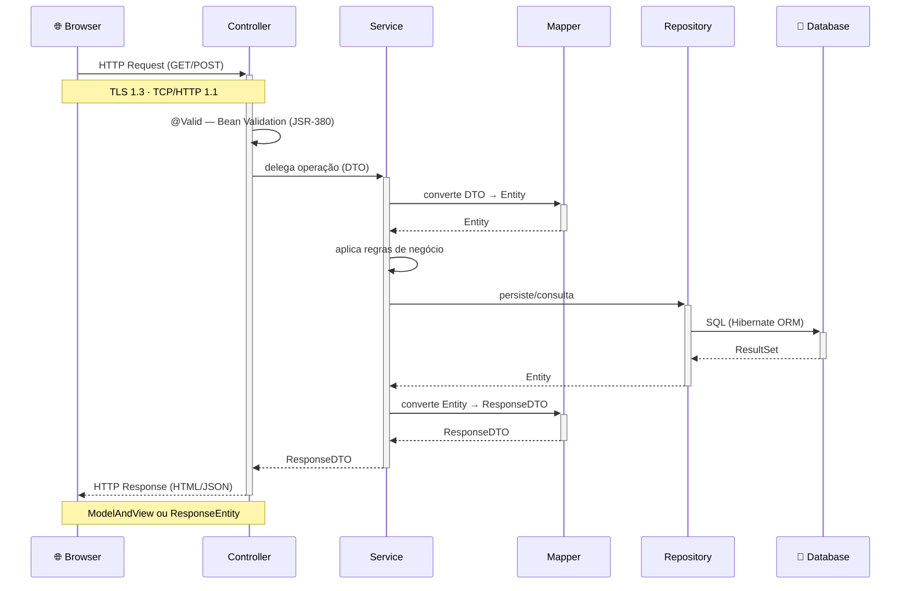

# 📦 Diagrama de Pacotes — Car Rental System

> **Versão:** 2.0 · **Sprint:** 02 — Revisão pós-feedback + alinhamento com implementação  
> **Arquitetura:** Micronaut · MVC em Camadas · Clean Architecture  
> **Notação:** UML 2.5 · **Formato:** Mermaid (ISO/IEC 19501 compliant)  
> **Renderização nativa:** GitHub, GitLab, Azure DevOps, Confluence, Notion

---

## Changelog (v1.0 → v2.0)

| Alteração | Motivo |
|-----------|--------|
| Adicionado `HomeController` ao pacote `controller` | Ponto de entrada raiz `/` com redirect |
| Adicionado DTOs de endereço e empregador (`AddressDTO`, `EmployerDTO`) | Formulários de CRUD de cliente necessitam DTOs aninhados |
| Adicionado pacote `exception` com classes concretas | Implementação do `GlobalExceptionHandler` com `@Error (Micronaut)` |
| Dependência `MAPPER → DTO` explicitada | O Mapper transforma bidireccionalmente Entity ↔ DTO |
| Alinhamento com estrutura real de pacotes Java implementada | Diagrama reflete o código fonte — diagrama como código |

---

## Visão Geral da Arquitetura de Pacotes

---

## Dependências entre Pacotes

---

## Regra de Dependência

> **Regra de ouro:** cada camada só conhece a camada imediatamente abaixo — **nunca acima**.  
> A dependência flui de fora para dentro, conforme prescrito pela *Clean Architecture* (Martin, 2017).

---

## Fluxo de Dados HTTP

---

## Notas Arquiteturais

### Por que MVC em Camadas?

| Decisão | Justificativa |
|---------|---------------|
| **Controller sem lógica** | SRP (Single Responsibility Principle) — o Controller apenas roteia HTTP e delega ao Service. O mesmo caso de uso pode ser invocado via HTTP, filas ou testes. |
| **Service como Facade** | Padrão Facade (GoF) — orquestra casos de uso, controla transações `@Transactional` e implementa a máquina de estados. |
| **Repository como abstração** | Padrão Repository (DDD — Evans) — isola o domínio do mecanismo de persistência. Swapable: H2 ↔ PostgreSQL sem impacto. |
| **DTOs separados de Entities** | Evita over-fetching, coupling e vulnerabilidades de mass assignment. DTOs são contratos de API versionáveis. |
| **Mapper dedicado** | Responsabilidade única de transformação Entity ↔ DTO. Facilita testes e evolução independente. |

### Pacotes Cross-Cutting

- **`config/`** — Configurações transversais: `SecurityConfig` (Micronaut Security + CSRF), `WebMvcConfig` (Thymeleaf, CORS), `PersistenceConfig` (DataSource, JPA).
- **`exception/`** — Tratamento centralizado via `@Error (Micronaut)`. Mapeia exceções de domínio → HTTP status codes (RFC 7807 — Problem Details for HTTP APIs).

---

## Ferramentas de Visualização

| Ferramenta | Suporte Nativo | Uso Corporativo |
|-----------|---------------|-----------------|
| **GitHub** | ✅ Renderiza `.md` com Mermaid | Microsoft, Google, Amazon |
| **GitLab** | ✅ Nativo desde v 15.0 | Fortune 500 |
| **Azure DevOps** | ✅ Wiki e Repos | Enterprises Microsoft stack |
| **Confluence** | ✅ Via plugin Mermaid | Atlassian ecosystem |
| **Notion** | ✅ Blocos de código Mermaid | Startups e scale-ups |
| **VS Code** | ✅ Markdown Preview Mermaid | Qualquer desenvolvedor |
| **IntelliJ IDEA** | ✅ Plugin Mermaid | JetBrains ecosystem |

